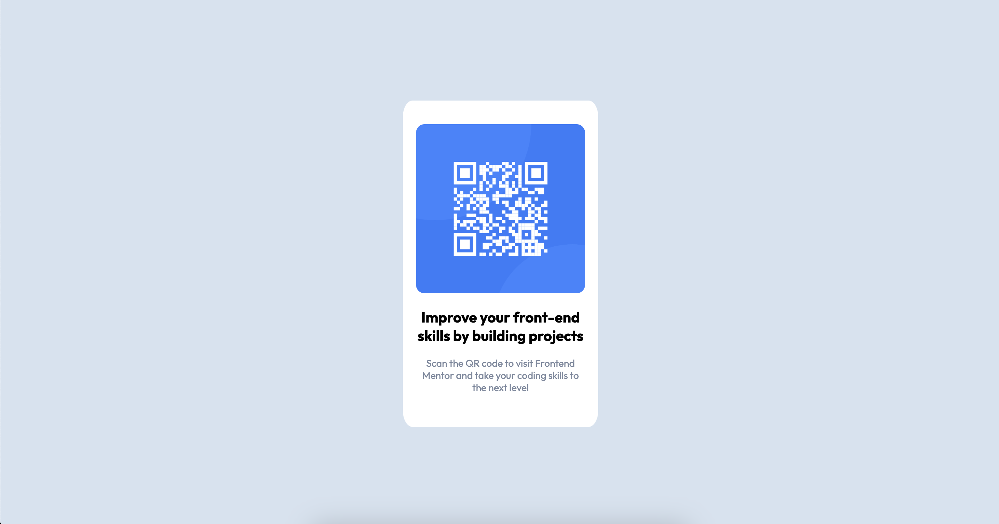

# Frontend Mentor - QR code component solution

This is a solution to the [QR code component challenge on Frontend Mentor](https://www.frontendmentor.io/challenges/qr-code-component-iux_sIO_H). Frontend Mentor challenges help you improve your coding skills by building realistic projects. 

## Table of contents

- [Overview](#overview)
  - [Screenshot](#screenshot)
  - [Links](#links)
- [My process](#my-process)
  - [Built with](#built-with)
  - [What I learned](#what-i-learned)
  - [Continued development](#continued-development)
  - [Useful resources](#useful-resources)
- [Author](#author)
- [Acknowledgments](#acknowledgments)

**Note: Delete this note and update the table of contents based on what sections you keep.**

## Overview

### Screenshot



### Links

- Solution URL: [Solution URL](https://github.com/Kamania/qr-code-component)
- Live Site URL: [Live Site URL](https://qr-code-component-rho-drab.vercel.app/)

## My process

### Built with

- Semantic HTML5 markup
- CSS custom properties
- Flexbox
- Mobile-first workflow


### What I learned

Use this section to recap over some of your major learnings while working through this project. Writing these out and providing code samples of areas you want to highlight is a great way to reinforce your own knowledge.

To see how you can add code snippets, see below:

```css
:root {
  --white: hsl(0, 0%, 100%);
  --light-gray: hsl(212, 45%, 89%);
  --blue-gray: hsl(220, 15%, 55%);
  --dark-blue: hsl(218, 44%, 22%);
  --mobile: 375px;
  --desktop: 1440px;
}
```

### Continued development

Next I'll be focusing on using Bootstrap on this project

## Author

- Frontend Mentor - [@Kamania](https://www.frontendmentor.io/profile/Kamania)
- Twitter - [@Josephkamania](https://twitter.com/Josephkamania)

